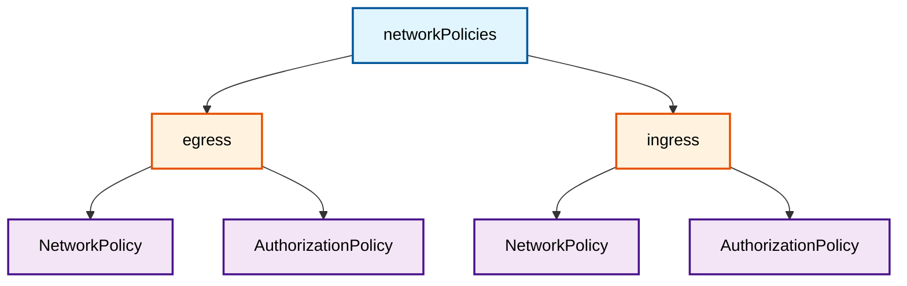
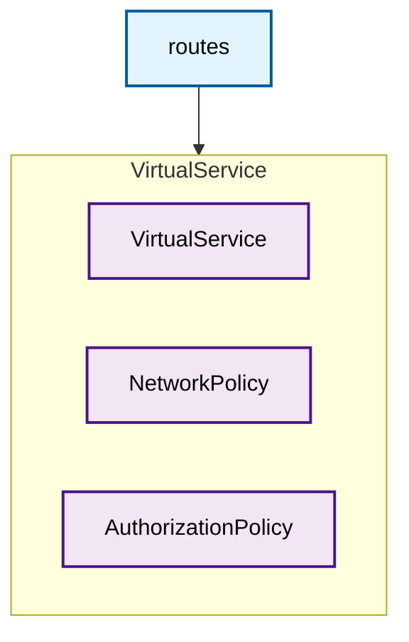

# Resource Generation Graph

This graph shows the relationship between the top-level bb-common keys and the Kubernetes resources they generate.

## Network Policies

```mermaid
graph TB
    A[networkPolicies] --> A1[egress]
    A --> A2[ingress]
    A1 --> A3[NetworkPolicy]
    A1 --> A4[AuthorizationPolicy]
    A2 --> A6[NetworkPolicy]
    A2 --> A7[AuthorizationPolicy]
    
    %% Styling
    classDef configKeys fill:#e1f5fe,stroke:#01579b,stroke-width:2px,color:black;
    classDef resources fill:#f3e5f5,stroke:#4a148c,stroke-width:2px,color:black;
    classDef subKeys fill:#fff3e0,stroke:#e65100,stroke-width:2px,color:black;
    
    class A configKeys;
    class A1,A2 subKeys;
    class A3,A4,A5,A6,A7 resources;
```

## Routes

```mermaid
graph TD
    B[routes] --> VH[VirtualService]
    
    subgraph VH[VirtualService]
        B1[VirtualService]
        B2[NetworkPolicy]
        B3[AuthorizationPolicy]
    end

    %% Styling
    classDef configKeys fill:#e1f5fe,stroke:#01579b,stroke-width:2px,color:black;
    classDef resources fill:#f3e5f5,stroke:#4a148c,stroke-width:2px,color:black;
    classDef subKeys fill:#fff3e0,stroke:#e65100,stroke-width:2px,color:black;
    
    class B,C configKeys;
    class C1 subKeys;
    class B1,B2,B3,C2,C3 resources;
```
