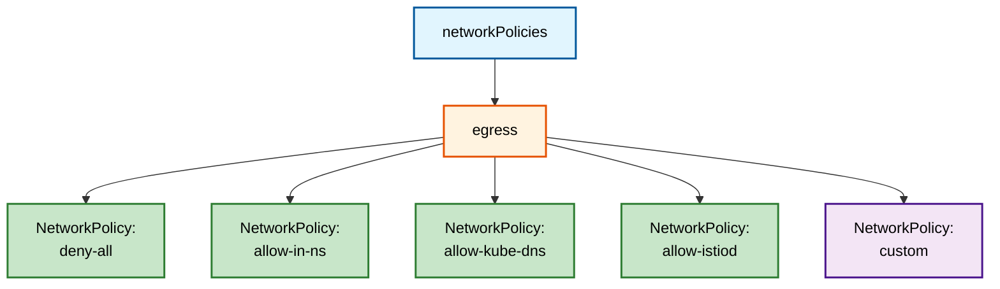
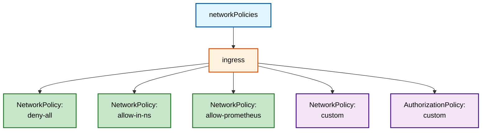
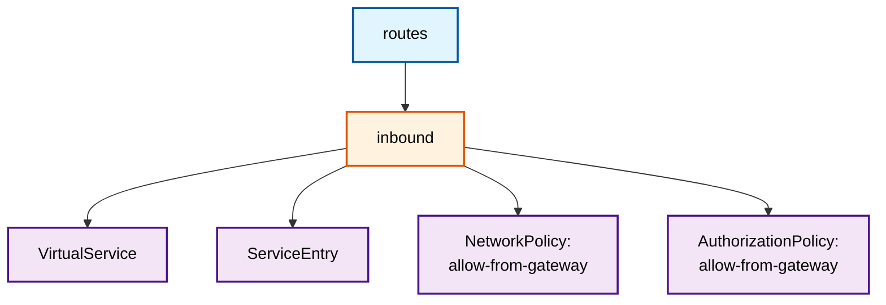
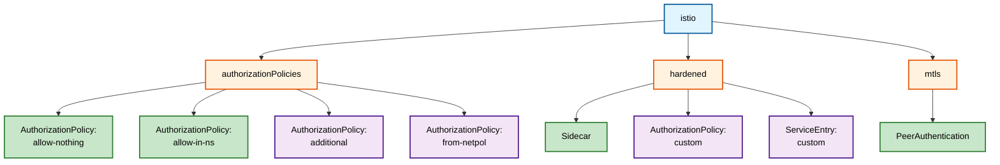

# Resource Generation Graph

This graph shows the relationship between the top-level bb-common keys and the Kubernetes resources they generate.

**Color Legend:**

- 🔵 Blue: Top Level Configuration keys
- 🟠 Orange: Sub-configuration keys
- 🟢 Green: Default resources (typically automatically created)
- 🟣 Purple: Custom resources (user-defined)

## Network Policies

### Egress

---

### Ingress

---

## Routes

---

## Istio

